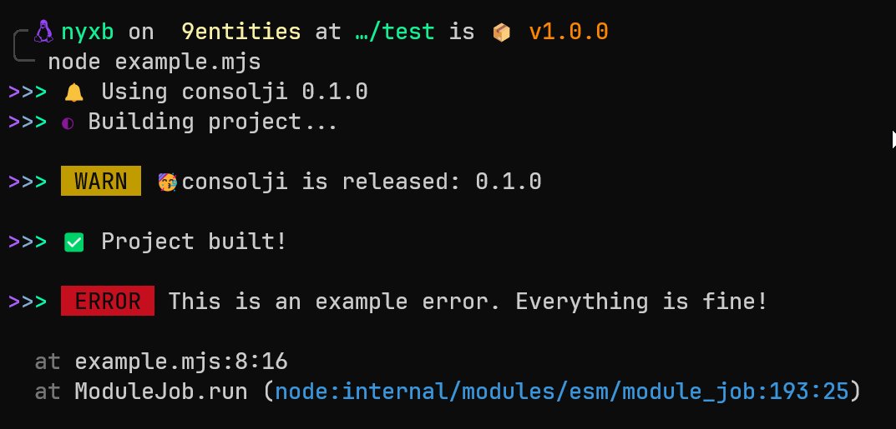

<p align="center">


</p>

<a href="https://www.npmjs.com/package/@nyxb/eslint-config"></a>
<a href="https://www.npmjs.com/package/consolji">

---

> Elegant Console Wrapper

## Why Consolji?

Consolji's Enchanting Features:

✨&nbsp; Effortless to use</br>
🎩&nbsp; Captivating output with graceful fallbacks</br>
🔮&nbsp; Enchanting reporters to suit your needs</br>
💻&nbsp; Seamless command line experience</br>
🏷️&nbsp; Tag support for organized logging</br>
🌐&nbsp; Cross-platform compatibility, including browsers</br>
⏯️&nbsp; Pause and resume logging as needed</br>
🎭&nbsp; Embrace the power of log mocking</br>
🚫&nbsp; Prevent log spam with sorcery of throttling</br>
🔁&nbsp; Intercept and redirect `console` and `stdout/stderr` with ease</br>
💙&nbsp; Full [conventional💙Commit](conventional💙commits.ws) support</br>
❯&nbsp; Interactive prompt support with the magic of [`tyck`](https://github.com/nyxb/tyck)


## Installation
Using [nyxi](https://github.com/nyxb/nyxi)

```bash
nyxi consolji
```

Using npm:

```bash
npm i consolji
```

Using yarn:

```bash
yarn add consolji
```

Using pnpm:

```bash
pnpm add consolji
```

## Getting Started

```js
// ESM
import { consolji, createConsolji } from 'consolji'

// CommonJS
const { consolji, createConsolji } = require('consolji')

consolji.info('Using consolji 0.0.1')
consolji.start('Building project...')
consolji.warn('🥳 consolji is published: 0.0.1')
consolji.success('Project built!')
consolji.error(new Error('This is an example error. Everything is fine!'))
await consolji.prompt('Deploy to the production?', {
   type: 'confirm',
})
```

Will display in the terminal:



You can use smaller core builds without fancy reporter to save 80% of the bundle size:

```ts
import { consolji, createconsolji } from 'consolji/basic'
import { consolji, createconsolji } from 'consolji/browser'
import { createconsolji } from 'consolji/core'
```

## consolji Methods

#### `<type>(logObject)` `<type>(args...)`

Log to all reporters.

Example: `consolji.info('Message')`

#### `await prompt(message, { type })`

Show an input prompt. Type can either of `text`, `confirm`, `select` or `multiselect`.

See [examples/prompt.ts](./examples/prompt.ts) for usage examples.

#### `addReporter(reporter)`

- Aliases: `add`

Register a custom reporter instance.

#### `removeReporter(reporter?)`

- Aliases: `remove`, `clear`

Remove a registered reporter.

If no arguments are passed all reporters will be removed.

#### `setReporters(reporter|reporter[])`

Replace all reporters.

#### `create(options)`

Create a new `consolji` instance and inherit all parent options for defaults.

#### `withDefaults(defaults)`

Create a new `consolji` instance with provided defaults

#### `withTag(tag)`

- Aliases: `withScope`

Create a new `consolji` instance with that tag.

#### `wrapConsole()` `restoreConsole()`

Globally redirect all `console.log`, etc calls to consolji handlers.

#### `wrapStd()` `restoreStd()`

Globally redirect all stdout/stderr outputs to consolji.

#### `wrapAll()` `restoreAll()`

Wrap both, std and console.

console uses std in the underlying so calling `wrapStd` redirects console too.
Benefit of this function is that things like `console.info` will be correctly redirected to the corresponding type.

#### `pauseLogs()` `resumeLogs()`

- Aliases: `pause`/`resume`

**Globally** pause and resume logs.

consolji will enqueue all logs when paused and then sends them to the reported when resumed.

#### `mockTypes`

- Aliases: `mock`

Mock all types. Useful for using with tests.

The first argument passed to `mockTypes` should be a callback function accepting `(typeName, type)` and returning the mocked value:

```js
consolji.mockTypes((typeName, type) => jest.fn())
```

Please note that with the example above, everything is mocked independently for each type. If you need one mocked fn create it outside:

```js
const fn = jest.fn()
consolji.mockTypes(() => fn)
```

If callback function returns a _falsy_ value, that type won't be mocked.

For example if you just need to mock `consolji.fatal`:

```js
consolji.mockTypes(typeName => typeName === 'fatal' && jest.fn())
```

**NOTE:** Any instance of consolji that inherits the mocked instance, will apply provided callback again.
This way, mocking works for `withTag` scoped loggers without need to extra efforts.

## Custom Reporters

consolji ships with 3 built-in reporters out of the box. A fancy colored reporter by default and fallsback to a basic reporter if running in a testing or CI environment detected using [unjs/std-env](https://github.com/unjs/std-env) and a basic browser reporter.

You can create a new reporter object that implements `{ log(logObject): () => { } }` interface.

**Example:** Simple JSON reporter

```ts
import { createconsolji } from 'consolji'

const consolji = createconsolji({
   reporters: [
      {
         log: (logObj) => {
            console.log(JSON.stringify(logObj))
         },
      },
   ],
})

// Prints {"date":"2023-04-18T12:43:38.693Z","args":["foo bar"],"type":"log","level":2,"tag":""}
consolji.log('foo bar')
```

## Log Level

consolji only shows logs with configured log level or below. (Default is `3`)

Available log levels:

- `0`: Fatal and Error
- `1`: Warnings
- `2`: Normal logs
- `3`: Informational logs, success, fail, ready, start, ...
- `4`: Debug logs
- `5`: Trace logs
- `-999`: Silent
- `+999`: Verbose logs

You can set the log level by either:

- Passing `level` option to `createconsolji`
- Setting `consolji.level` on instance
- Using the `consolji_LEVEL` environment variable (not supported for browser and core builds).

## Log Types

Log types are exposed as `consolji.[type](...)` and each is a preset of styles and log level.

A list of all available built-in types is [available here](./src/constants.ts).

## Creating a new instance

consolji has a global instance and is recommended to use everywhere.
In case more control is needed, create a new instance.

```js
import { createconsolji } from 'consolji'

const logger = createconsolji({
   // level: 4,
   // fancy: true | false
   // formatOptions: {
   //     columns: 80,
   //     colors: false,
   //     compact: false,
   //     date: false,
   // },
})
```

## Integrations

### With jest or vitest

```js
describe('your-consolji-mock-test', () => {
   beforeAll(() => {
      // Redirect std and console to consolji too
      // Calling this once is sufficient
      consolji.wrapAll()
   })

   beforeEach(() => {
      // Re-mock consolji before each test call to remove
      // calls from before
      consolji.mockTypes(() => jest.fn())
   })

   test('your test', async () => {
      // Some code here

      // Let's retrieve all messages of `consolji.log`
      // Get the mock and map all calls to their first argument
      const consoljiMessages = consolji.log.mock.calls.map(c => c[0])
      expect(consoljiMessages).toContain('your message')
   })
})
```

### With jsdom

```js
{
   virtualConsole: new jsdom.VirtualConsole().sendTo(consolji)
}
```

## License

MIT
